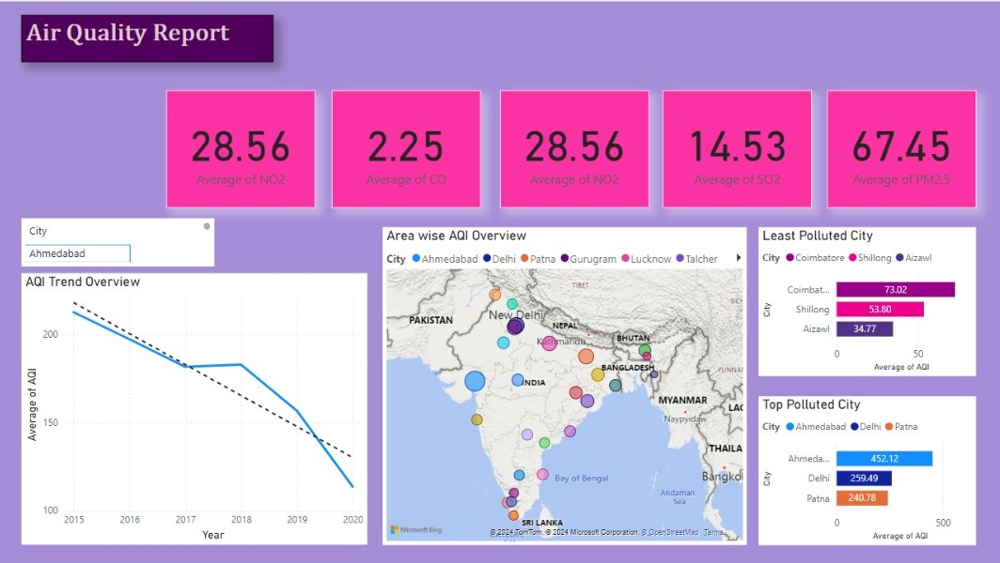

# Data Analyst

### Technical Skills: Python, SQL, Excel, PowerBI 

## Education

Bachelor’s in Business Management | University Of Roehampton | 2021 – 2024
Modules: Business Data Analysis, Accounting & Finance, Economics, Project Management, 
Corporate Strategy, Global Marketing, Operations, Logistics & Supply Chain Management.

Dissertation: Contemporary Issues in Management (Distinction)

## Work Experience

Marketing Intern | Affinity Aviation Group Ltd | May 2024 - June 2024 | London, UK

Strategically planned and managed social media accounts across platforms including Instagram, Facebook, TikTok, and LinkedIn, increasing overall engagement by 25%.
Developed compelling copy for social media posts and marketing campaigns, contributing to a 15% growth in follower base.
Conducted in-depth growth analysis, tracking key performance metrics and improving lead generation by 30%.
Monitored user engagement, site traffic, and campaign effectiveness, achieving a 20% increase in website visits.
Compiled and presented actionable insights to the team, resulting in a 10% improvement in conversion rates.

## Project

## Customer Churn Analysis Project

**Overview**

This project analyzes customer churn in the telecommunications industry to identify key drivers and actionable insights. Using Python, I cleaned and explored the data to uncover patterns in customer behavior, service usage, and billing.

**Key Features**
- Data cleaning and preparation (handling missing values, type conversions).
- Exploratory analysis of churn drivers like tenure, contract type, and payment methods.
- Visualizations (bar charts, count plots) to highlight trends and insights.

**Technologies Used**
Python, Pandas, NumPy, Matplotlib, Seaborn.

**Future Enhancements**
- Build a churn prediction model.
- Develop strategies for customer retention.

This project highlights my skills in data analysis and problem-solving using real-world datasets.

## SQL Music Store Data Project: Data Analysis and Insights 

This project demonstrates my proficiency in SQL through a series of advanced queries aimed at extracting actionable insights from relational databases. Key highlights include:  

- *Database Exploration:* Retrieved and analyzed data from tables such as artist, employee, invoice, and customer to gain a deeper
understanding of the dataset structure and relationships.  
- *Data Aggregation and Ranking:* Identified the senior-most employee, countries with the highest number of invoices, and cities with the highest invoice totals.  
- *Customer and Sales Insights:* Discovered the best customers based on spending patterns and identified the top-performing artist and rock music listeners.  
- *Performance Metrics:* Calculated and filtered tracks with durations exceeding the average length, ordering them by longest first.  
- *Advanced SQL Techniques:* Utilized joins, subqueries, aggregate functions, and Common Table Expressions (CTEs) to answer complex business questions, such as total spending on artists by customers.  

This project showcases my ability to write optimized SQL queries for data analysis, reporting, and deriving meaningful business insights. 
It emphasizes my skills in statistical analysis, data visualization preparation, and problem-solving in real-world scenarios.

## Air Quality Index (AQI) Dashboard for India

This project is an interactive dashboard that visualizes the Air Quality Index (AQI) data for various cities across India. It provides insights into pollution levels and key pollutants such as NO2, CO, SO2, and PM2.5. The dashboard is built to allow users to select a city and view detailed air quality trends and comparisons.

### Features
- *City-Level Analysis*: Select any city to view its specific air quality details.
- *AQI Trend Overview*: A line chart displaying the AQI trend over the years (2015-2020) for the selected city.
- *Pollutant Averages*: Displays the average levels of NO2, CO, SO2, and PM2.5 for the selected city.
- *Geospatial Visualization*: An interactive map of India highlighting AQI levels in different regions using color-coded markers.
- *Top and Least Polluted Cities*: A ranking of cities with the highest and lowest AQI values, enabling quick comparisons.

### Technologies Used
- *Power BI*: For creating interactive and visually appealing data visualizations.
- *Data Sources*: AQI data from reliable sources (e.g., government or environmental organizations).

### Key Insights
- Compare pollution levels across Indian cities and states.
- Track the improvement or degradation of air quality over time.
- Identify the most and least polluted regions in India.

This project is an excellent tool for researchers, policymakers, and environmental enthusiasts to understand and monitor air quality trends in India.

## Project Title: Interactive Coffee Sales Dashboard in Excel  

This project showcases an interactive and visually appealing coffee sales dashboard created using advanced Excel techniques. 
The dashboard effectively consolidates and visualizes sales data, making it easier to analyze trends and make data-driven decisions.  

Key steps and features of the project include:  
- Data Analysis Functions: Utilized *XLOOKUP* and *INDEX MATCH* for efficient data retrieval and relational lookups.  
- Sales Metrics: Applied multiplication formulas and *multiple IF functions* for dynamic calculations and logical operations.  
- Data Formatting: Ensured consistent and professional presentation with proper *DATE and NUMBER FORMATING*.  
- Data Validation*: Checked for duplicates and converted data ranges into structured tables for better manageability.  
- Data Visualization: Created *PIVOT TABLES and CHARTS*, enhanced with slicers, timelines, and dynamic formatting for deeper insights.  
- Dashboard Creation*: Designed and built a user-friendly dashboard, integrating all key data elements and visual components.

## Project Title: Sales Analysis Dashboard for Madhav E-commerce Sales  

This project involved creating a comprehensive sales analysis dashboard for Madhav E-commerce Sales using Power BI. 
It demonstrates the ability to leverage Power BI's tools for data visualization and insights. Key steps include:
  
- Importing and transforming raw data using *Power Query* for cleaning and preparation.  
- Utilizing *DAX (Data Analysis Expressions)* to perform calculations and derive meaningful metrics.  
- Designing an optimized *data model* for seamless analysis and reporting.  
- Building an interactive, visually appealing *dashboard* to analyze sales performance, trends, and key metrics.  

This project highlights proficiency in Power BI, including data preparation, modeling, and creating actionable dashboards.

